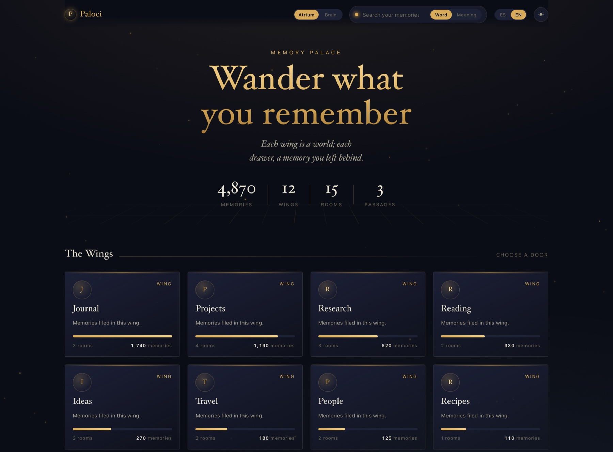
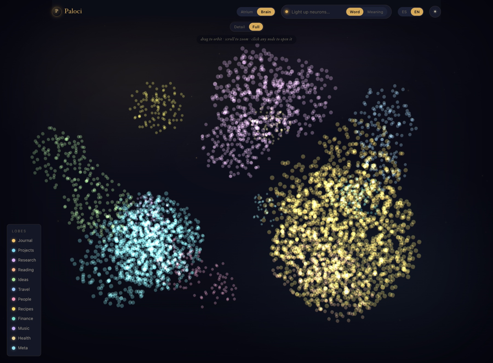
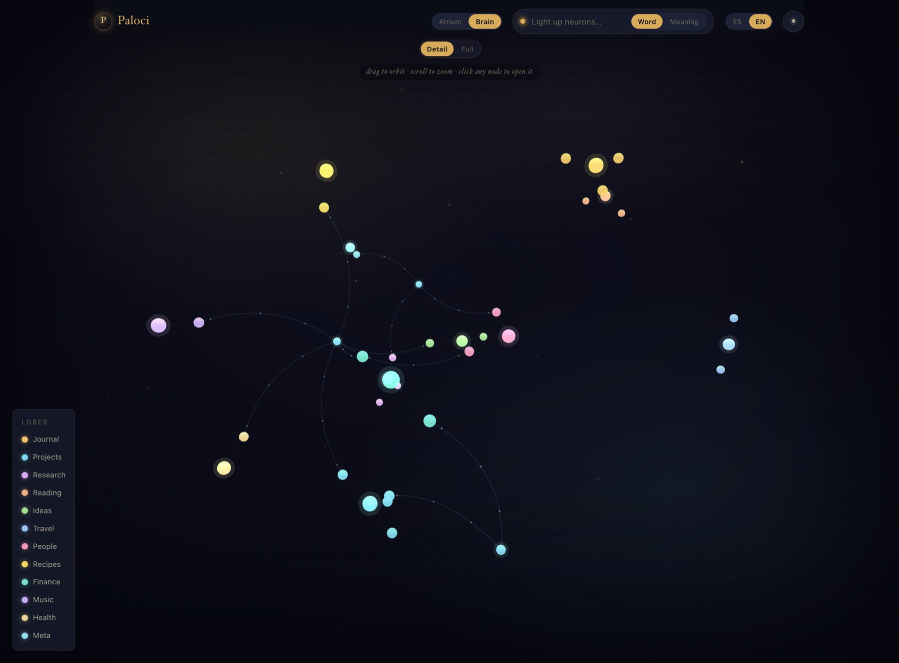

# 🏛 Paloci

> *A candlelit viewer for your MemPalace. Walk your memories by the method of loci.*

**Paloci** is a local web viewer that lets you **explore your [MemPalace](https://github.com/milla-jovovich/mempalace) as a memory palace**: you enter through the atrium, choose a wing, pull open its drawers (rooms), and read the full memories inside. All lit by candlelight, in English or Spanish.

Unlike a static snapshot, it **reads live** from the MemPalace database: every reload reflects the current state.



> *(Screenshots use a small demo palace with made-up wings and memories.)*

## The name

**Paloci** = **Pala**ce + **Loci**.

The *method of loci* (a.k.a. the "memory palace") is the ancient technique of remembering by placing ideas in the rooms of an imagined building and walking through it in your mind. Paloci takes that literally: it turns your AI's memory into a palace you can actually walk — wings, rooms, and drawers you open one by one.

## How it works

```
Browser (localhost:8787)  ──fetch──▶  server.js (Node, stdlib only)
   the palace (public/)   ◀──JSON──   reads chroma.sqlite3 READ-ONLY
                                             │
                                             ▼
                           ~/.mempalace/palace/chroma.sqlite3  (ChromaDB)
```

- **Backend** (`server.js` + `lib/`): uses the native `node:sqlite` module — **no `npm install`**. Opens the MemPalace database **read-only** (never touches your MemPalace) and exposes a small JSON API.
- **Frontend** (`public/`): plain HTML + CSS + native ES modules — no bundler, no build step.
- **Only dependency:** the Brain view uses `3d-force-graph` (which bundles three.js), **vendored** into `public/vendor/` — served by your own server, no CDN and no `npm install`. Everything still runs 100% offline.

## Project layout

The code follows separation of concerns: a layered backend, one ES module per
frontend view, and a composition root (`main.js`) that wires everything.
Modules that would otherwise import each other in a cycle communicate through
a tiny event bus (`store.js`) instead.

```
server.js            entry point
lib/                 backend, layered
  config.js          environment & paths
  db.js              read-only SQLite connection + prepared statements
  meta.js            structural wing metadata (seal + kind)
  palace.js          domain: builds the JSON responses
  semantic.js        MemPalace CLI integration (semantic search)
  server.js          HTTP routes + static files
public/
  index.html         markup only
  css/               tokens (theme), base chrome, atrium, brain, overlays
  js/                native ES modules (no build step)
    main.js          composition root: boot + cross-cutting wiring
    store.js         shared state + event bus
    i18n.js          dictionaries and translation helpers
    util.js          esc / dates / number formatting / fetch wrapper
    palette.js       kind accents + per-wing colors
    reader.js        the memory reader modal
    atrium.js        landing view, wing page, breadcrumbs, minimap
    search.js        the lantern (word/meaning, atrium filter, brain relay)
    brain.js         the 3D neural view
    hive.js          the honeycomb panel
    theme.js         light/dark toggle
    motes.js         ambient dust canvas
  vendor/            3d-force-graph (vendored)
```

## Requirements

- **Node ≥ 22.5** (for the built-in `node:sqlite` module). Check with `node --version`.
- **MemPalace**, with at least one palace. That's it — no other setup.

## Quick start

```bash
git clone <this-repo> paloci
cd paloci
npm start
```

Then open **http://localhost:8787**. To stop it: `Ctrl+C`.

There is nothing to configure: Paloci **auto-discovers your palace** the same
way the MemPalace CLI does — it reads `palace_path` from
`~/.mempalace/config.json`, and falls back to the default
`~/.mempalace/palace/chroma.sqlite3`. It opens that database **read-only**, so
it can never modify your MemPalace. Semantic search reuses your `mempalace`
CLI, also found automatically.

## Configuration (optional)

Only needed if something lives in a non-standard place:

| Variable | Default | What it does |
|---|---|---|
| `PORT` | `8787` | HTTP port |
| `MEMPALACE_DB` | auto-discovered (see above) | Path to the ChromaDB database |
| `MEMPALACE_BIN` | `~/.local/bin/mempalace` or `mempalace` on `PATH` | CLI used for semantic search |

Example: `PORT=9000 MEMPALACE_DB=/other/path/chroma.sqlite3 npm start`

## API

| Endpoint | Returns |
|---|---|
| `GET /api/overview` | Stats + wings (with rooms and counts) + tunnels |
| `GET /api/wing?id=<wing>` | A wing's rooms with their most recent memories (previews) |
| `GET /api/drawer?id=<n>` | The full text of a single memory |
| `GET /api/nodes` | All neurons (id + wing + room) for the Brain "Full" mode |
| `GET /api/match?q=<text>` | Ids of the neurons whose text matches — used to light them up in the Brain |
| `GET /api/search?q=<text>&mode=text` | **Word** search — exact matches (instant) |
| `GET /api/search?q=<text>&mode=semantic` | **Meaning** search (via the MemPalace CLI) |

## Brain view (3D graph)

An **Atrium ⇄ Brain** toggle in the top bar opens a navigable 3D view (drag to orbit, scroll to zoom) where the palace looks like a **neural network**: each wing is a lobe, each room a cluster, each memory a neuron; the **tunnels** are the threads that cross from one lobe to another. Click a neuron → it opens that memory in the reader.

| Full — every memory as a glowing neuron | Detail — lobes & rooms as a constellation |
|:---:|:---:|
|  |  |

It has two densities (a **Detail / Full** switch):

- **Detail** (default) — shows the lobes and their rooms with live force physics; clicking a room unfolds its neurons. Always smooth.
- **Full** — draws **all ~13,600 neurons at once**, grouped by lobe and room. The raw visual punch; it's the heaviest mode (takes a moment to light up).

The legend at the bottom lists the lobes by color; click one to focus the camera on it.

**Every node opens something.** Clicking a single neuron opens that memory in the reader. Clicking a **group node** — a lobe (wing), a room cluster, or a passage hub — opens the **Hive**: a honeycomb panel where the contents are laid out as interlocking hexagonal cells. A lobe shows its rooms as cells; a room shows its most recent memories as cells (click one → full reader); a passage shows the wings it connects. Drill down with clicks, come back with the ← button, close with Esc.

## Search

The search box (the "lantern") in the top bar has a **Word / Meaning** switch:

- **Word** — exact text match, instant (SQL `LIKE` over the memory content).
- **Meaning** — semantic search over embeddings, via the `mempalace search`
  CLI. It understands synonyms and ideas: a search for a concept surfaces
  related memories even when they never use those exact words. The first
  query takes a few seconds while the model loads, so it runs on **Enter**;
  each result shows its **affinity** (cosine similarity).

Where the matches show up depends on the view:

- In the **Atrium**, they're listed as a page — click one to open the full memory.
- In the **Brain**, they **light up** as glowing neurons (bright and enlarged)
  while the rest fade to ghosts, with a `🔦 N lit up` counter. It switches to
  Full mode so every match exists to glow; clear the box to restore the brain.

## Languages (i18n)

The interface ships in **English and Spanish**, with an **ES / EN** switch in the top bar.

- **Default language:** your system/browser locale. If it's Spanish → Spanish; anything else → **English** (fallback).
- Your choice is **remembered** across sessions (localStorage).
- The **interface** is translated: buttons, headings, categories, search, reader, number formatting (`13,627` vs `13.627`), etc.
- Your **data is not translated** — wing/room names come straight from their ids and memory content is shown exactly as you saved it. (Names are data, not interface.)

All language logic lives in the frontend (`public/js/i18n.js`, the `I18N` object); the backend only returns structural ids.

## Glossary

- **Wing** — a project or context (e.g. `Sessions`, `Notes`, `Ideas`).
- **Room** — a category within a wing (e.g. `Technical`, `Problems`, `Journal`).
- **Memory** (*drawer / chunk*) — a memory entry, with its date and text.
- **Tunnel** — a room that exists across several wings at once (e.g. `Journal`, `Scripts`).

## Works with any palace

Paloci reads whatever wings, rooms and memories your MemPalace has and
**names everything automatically** from the ids (e.g. `weekly_review` →
"Weekly Review", `gap-analysis` → "Gap Analysis"). Nothing is pre-wired to a
particular palace — just point it at your database and go.

To **curate your own labels** (optional), edit two spots:
- `lib/meta.js` — give a wing a monogram (`seal`) and a category (`kind`,
  which tints its accent).
- `public/js/i18n.js` — give a wing a display `name` and `blurb`, or add
  labels for your rooms, in each language.

## Notes

- Semantic search shells out to your `mempalace` CLI; point it with `MEMPALACE_BIN` if it isn't at `~/.local/bin/mempalace` or on your `PATH`.
- Counts are of stored **entries** (some long memories are saved as several chunks), so they may differ slightly from MemPalace's own "drawer" count.
- The database is always opened **read-only**: this viewer never writes to your MemPalace.

---

Built with Node (no `npm install`; the one library, for the 3D view, is vendored in the repo). Run it whenever you like; stop it with `Ctrl+C`.
